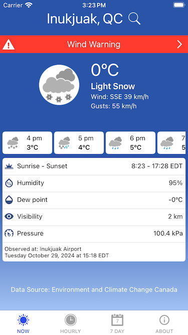
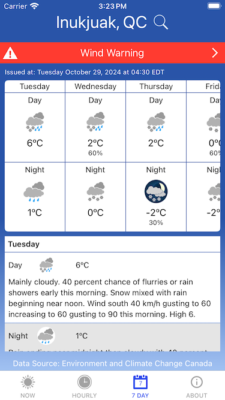

# Alt Weather Canada

This app has been created by Hanno Rein. Its purpose is to provide a simple and intuitive way to view weather information for your location. The functionality and design tries to replicate the old WeatherCan App that was developed by Environment and Climate Change Canada (ECCC). The development of this alternative app was triggered by the redesign of the WeatherCan App in October 2024 which significantly reduced readability due to a low contrast colour scheme and a reduced information density. Not all features found in the original WeatherCan App have been replicated yet. Contributions and bug reports are welcome!

This app uses publicly available data provided by Environment and Climate Change Canada (ECCC). However the app is not affiliated with or endorsed by ECCC in any way. The use of this app is at your own risk. The developers and associated parties are not responsible for any damages, losses, or negative consequences that may arise from your use of the app. We make no guarantees regarding the accuracy, reliability, or completeness of the information provided. By using this app, you acknowledge and agree that you will not hold the developers liable for any issues that may occur.

## Screenshots

## License

You may do anything you want to with this code under two conditions:

1) You do not make any money by using this code. If you're in doubt what 'making money' means, ask.
2) If you use any part of this code, you prominently acknowledge the source and link back to the main repository at [https://github.com/hannorein/altweathercan](https://github.com/hannorein/altweathercan).
